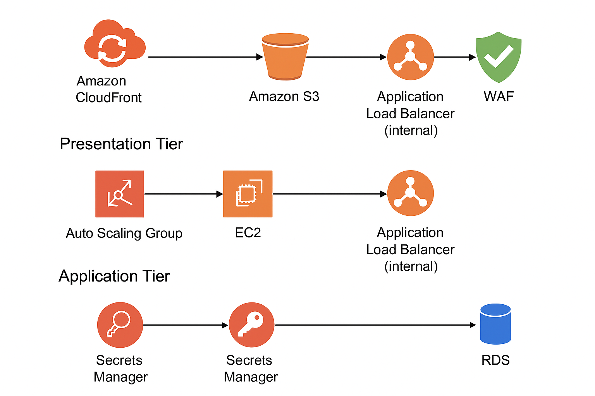

# 🏗️ 3-Tier AWS Lab (HA + Scale + Security)




**Stack:** CloudFront (+WAF) → S3 (static) & Web-ALB → Web ASG (Nginx) → App-ALB (internal) → App ASG (Apache/PHP) → RDS MySQL
**Secrets:** AWS Secrets Manager
**Monitoring:** Amazon CloudWatch (+ SNS)
**TLS:** CloudFront HTTPS (default cert now; ACM if/when you add a custom domain later)

> You’ll use the **CloudFront distribution URL** as your public endpoint (e.g., `https://dxxxxxxxx.cloudfront.net`). No Route 53 needed.

---

# 0) Prereqs

* AWS account with admin-ish access (for the lab).
* SSH key pair (or plan to use SSM Session Manager).
* A unique S3 bucket name (global namespace).
* Region: pick one (example uses **ap-south-1**; adapt if different).

---

# 1) Networking (VPC & Subnets)

1. **VPC → Create VPC → “VPC and more”**

   * Name: `three-tier-vpc`
   * AZs: **2**
   * Public subnets: **2**, Private subnets: **2**
   * NAT gateways: **1 per AZ** (creates **2**)
   * Create.

2. **Tags** (good hygiene): add `Project=ThreeTierLab`.

---

# 2) Database Tier (RDS MySQL)

1. **RDS → Create database**

   * Engine: **MySQL**, Template: **Free tier**
   * DB identifier: `three-tier-db`
   * Username: `dbadmin`; Password: choose strong
   * DB name: `appdb`
   * VPC: `three-tier-vpc`
   * Public access: **No**
   * Security group: create `db-sg` (temporarily allow MySQL 3306 from **0.0.0.0/0**; we’ll lock it later)
   * Storage: gp3 default is fine
   * Create (wait until **Available**).

> After creation, note the **RDS endpoint** (hostname).

---

# 3) Secrets Manager (DB Credentials)

1. **Secrets Manager → Store a new secret**

   * Type: **Other type of secret** (or “RDS credentials” wizard is fine)
   * Secret value (JSON):

     ```json
     {
       "host": "YOUR_RDS_ENDPOINT",
       "username": "dbadmin",
       "password": "YOUR_DB_PASSWORD",
       "dbname": "appdb"
     }
     ```
   * Name: `three-tier-db-credentials`
   * Encryption: default AWS managed key (OK)
   * Create.

2. **IAM Role for App Tier EC2**
   Create an **IAM role** `role-app-tier` (trusted entity: **EC2**) and attach a **least-privilege policy** for this secret:

   ```json
   {
     "Version": "2012-10-17",
     "Statement": [
       {
         "Sid": "SecretsRead",
         "Effect": "Allow",
         "Action": [
           "secretsmanager:GetSecretValue"
         ],
         "Resource": "arn:aws:secretsmanager:REGION:ACCOUNT_ID:secret:three-tier-db-credentials-*"
       },
       {
         "Sid": "KmsForSecrets",
         "Effect": "Allow",
         "Action": [
           "kms:Decrypt"
         ],
         "Resource": "*",
         "Condition": {
           "StringEquals": {
             "kms:ViaService": "secretsmanager.REGION.amazonaws.com"
           }
         }
       }
     ]
   }
   ```

   > Replace **REGION** and **ACCOUNT\_ID**. Attach this policy to the role.
   > Create an **instance profile** with the same name and add the role.

---

# 4) S3 (Static Frontend) + Files

1. **S3 → Create bucket**

   * Name: `three-tier-frontend-<unique>`
   * Block Public Access: **ON** (keep private!)
   * Bucket versioning: optional
   * Create.

2. **Frontend files (upload these to the bucket root):**

   **`index.html`**

   ```html
   <!DOCTYPE html>
   <html>
   <head>
       <title>3-Tier App Demo</title>
       <link rel="stylesheet" href="/styles.css">
   </head>
   <body>
       <h1>Welcome to the 3-Tier App Demo!</h1>
       <p>This static page is served from <strong>Amazon S3</strong> via <strong>CloudFront</strong>.</p>
       <a href="/api/db.php">Check the database connection</a>
   </body>
   </html>
   ```

   **`styles.css`**

   ```css
   body { font-family: Arial, sans-serif; background:#f7f7f7; text-align:center; padding-top:60px; }
   h1 { color:#2c3e50; margin-bottom:12px; }
   p { color:#34495e; font-size:18px; }
   a { display:inline-block; margin-top:20px; padding:10px 16px; background:#3498db; color:#fff; text-decoration:none; border-radius:6px; }
   a:hover { background:#2980b9; }
   ```

3. **Keep the bucket private**; we’ll allow CloudFront using **OAC** (Origin Access Control).

---

# 5) App Tier (Private ASG + Internal ALB + PHP/Apache)

## 5.1 App Security Group

* **`app-sg`** (for EC2 in App ASG)

  * Inbound: HTTP 80 **from** `web-sg` (we’ll create it later; temporarily allow 0.0.0.0/0 for bootstrap)
  * Inbound: SSH 22 from your IP (optional; preferred: SSM)
  * Outbound: all

## 5.2 App Launch Template

1. **EC2 → Launch Templates → Create**

   * Name: `lt-app-tier`
   * AMI: **Amazon Linux 2**
   * Type: `t2.micro`
   * Key pair: your key
   * **IAM instance profile**: `role-app-tier` (from step 3)
   * Security groups: `app-sg`
   * **User data** (installs Apache, PHP, Composer, AWS SDK, downloads PHP files from S3, sets region dynamically):

     ```bash
     #!/bin/bash
     set -e

     # System & packages
     yum update -y
     yum install -y httpd php php-mbstring php-json php-mysqlnd unzip curl

     # Apache
     systemctl enable httpd
     systemctl start httpd

     # Composer
     php -r "copy('https://getcomposer.org/installer', 'composer-setup.php');"
     php composer-setup.php --install-dir=/usr/local/bin --filename=composer
     rm -f composer-setup.php

     # Web root
     mkdir -p /var/www/html/api
     cd /var/www/html

     # PHP AWS SDK
     composer require aws/aws-sdk-php:^3

     # Region from IMDS
     REGION=$(curl -s http://169.254.169.254/latest/dynamic/instance-identity/document | grep region | awk -F\" '{print $4}')
     echo $REGION > /etc/aws_region

     # Fetch app files from S3 (upload them in step 7 first)
     aws s3 cp s3://three-tier-frontend-<unique>/db.php /var/www/html/api/db.php || true
     aws s3 cp s3://three-tier-frontend-<unique>/healthz.php /var/www/html/api/healthz.php || true

     # Replace placeholder region in db.php if present
     if grep -q "YOUR_AWS_REGION" /var/www/html/api/db.php; then
       sed -i "s/YOUR_AWS_REGION/${REGION}/g" /var/www/html/api/db.php
     fi

     # Permissions
     chown -R apache:apache /var/www/html
     chmod -R 0755 /var/www/html

     # Simple health page (fallback)
     echo "ok" > /var/www/html/api/health.txt

     systemctl restart httpd
     ```

   > Replace `three-tier-frontend-<unique>` with your bucket.

## 5.3 App Files (upload to the **same S3 bucket** so user data can pull them)

**`db.php`** (uses Secrets Manager via AWS SDK)

```php
<?php
require __DIR__ . '/../vendor/autoload.php';

use Aws\SecretsManager\SecretsManagerClient;
use Aws\Exception\AwsException;

$region = file_exists('/etc/aws_region') ? trim(file_get_contents('/etc/aws_region')) : 'YOUR_AWS_REGION';
$secretName = 'three-tier-db-credentials';

$client = new SecretsManagerClient([
  'version' => 'latest',
  'region'  => $region
]);

try {
  $result = $client->getSecretValue(['SecretId' => $secretName]);
  $secret = isset($result['SecretString']) ? json_decode($result['SecretString'], true) : [];
  $host = $secret['host'] ?? '';
  $user = $secret['username'] ?? '';
  $pass = $secret['password'] ?? '';
  $db   = $secret['dbname'] ?? '';

  $conn = new mysqli($host, $user, $pass, $db);
  if ($conn->connect_error) { die("Connection failed: " . $conn->connect_error); }

  echo "<h1>Database Connection Successful!</h1>";
  echo "<p>Connected securely using AWS Secrets Manager.</p>";
  $conn->close();
} catch (AwsException $e) {
  http_response_code(500);
  echo "Error retrieving secret: " . htmlspecialchars($e->getAwsErrorMessage());
}
```

**`healthz.php`**

```php
<?php
header('Content-Type: text/plain');
http_response_code(200);
echo "ok";
```

> Upload `db.php` and `healthz.php` to `s3://three-tier-frontend-<unique>/`.

## 5.4 App Target Group & Internal ALB

1. **EC2 → Target Groups → Create**

   * Type: Instances
   * Name: `tg-app`
   * Protocol: HTTP 80
   * Health check path: `/api/healthz.php`
   * Success codes: `200`
2. **EC2 → Load Balancers → Create (Application)**

   * Name: `alb-app-internal`
   * Scheme: **Internal**
   * VPC: `three-tier-vpc`
   * Subnets: **private** subnets
   * Security group: `alb-app-sg` (allow HTTP 80 **from** `web-sg` only)
   * Listener: HTTP:80 → forward to **`tg-app`**
3. **EC2 → Auto Scaling Groups**

   * Name: `asg-app`
   * Launch template: `lt-app-tier`
   * Subnets: **private** subnets
   * Attach to **`tg-app`**
   * Desired/Min: 2, Max: 4
   * Scaling policy: Target tracking, **Avg CPU = 70%**

---

# 6) Web Tier (Public ASG + Internet-facing ALB + Nginx Reverse Proxy)

## 6.1 Web Security Group

* **`web-sg`** (for EC2 in Web ASG)

  * Inbound: HTTP 80 **from** `alb-web-sg` (or temporarily 0.0.0.0/0 while bootstrapping)
  * Inbound: SSH 22 from your IP (optional; prefer SSM)
  * Outbound: all

* **`alb-web-sg`** (for Web ALB)

  * Inbound: HTTP 80 from **0.0.0.0/0** (public)
  * Outbound: all

## 6.2 Web Launch Template

1. **EC2 → Launch Templates → Create**

   * Name: `lt-web-tier`
   * AMI: **Amazon Linux 2**
   * Type: `t2.micro`
   * Key: your key
   * Security groups: `web-sg`
   * User data (installs Nginx and proxies `/api/` to App ALB):

     ```bash
     #!/bin/bash
     set -e
     yum update -y
     amazon-linux-extras install -y nginx1
     cat >/etc/nginx/conf.d/api.conf <<'EOF'
     server {
       listen 80 default_server;
       server_name _;

       # Health check for ALB
       location = /healthz {
         default_type text/plain;
         return 200 'ok';
       }

       # Proxy all API calls to the internal App ALB
       location /api/ {
         proxy_pass http://APP_ALB_DNS_NAME;
         proxy_set_header Host $host;
         proxy_set_header X-Forwarded-For $proxy_add_x_forwarded_for;
         proxy_set_header X-Forwarded-Proto $scheme;
       }

       # Anything else shouldn't hit Web tier (static served by S3 via CloudFront)
       location / { return 404; }
     }
     EOF

     systemctl enable nginx
     systemctl start nginx
     ```

   > After you create the App ALB, replace `APP_ALB_DNS_NAME` in this template with the **DNS name** of `alb-app-internal` and **save** the template. (Or launch once, then update and refresh ASG instances.)

## 6.3 Web Target Group & Public ALB

1. **Target Group**

   * Name: `tg-web`
   * Protocol: HTTP 80
   * Health check path: `/healthz`
2. **ALB**

   * Name: `alb-web-public`
   * Scheme: **Internet-facing**
   * Subnets: **public** subnets
   * Security group: `alb-web-sg`
   * Listener: HTTP:80 → forward to `tg-web`
3. **ASG**

   * Name: `asg-web`
   * Launch template: `lt-web-tier` (ensure `APP_ALB_DNS_NAME` is set)
   * Subnets: **public**
   * Attach to `tg-web`
   * Desired/Min: 2, Max: 4
   * Scaling policy: Target tracking, **Avg CPU = 70%**

---

# 7) CloudFront (+ WAF) with **Two Origins** and **Path-Based Routing**

## 7.1 Create Distribution

1. **Origins**

   * **Origin #1 (S3 static)**

     * Origin domain: your **S3 bucket** (choose from list; **not** the website endpoint)
     * **Origin access:** **Origin Access Control (OAC)** → Create new OAC.
   * **Origin #2 (Web ALB)**

     * Origin domain: `alb-web-public` **DNS name**
     * Protocol: HTTP only to origin (viewer will be HTTPS)

2. **Behaviors**

   * **Default behavior**:

     * Origin: **S3**
     * Viewer protocol: **Redirect HTTP to HTTPS**
     * Cache policy: **Managed-CachingOptimized**
     * Allowed methods: GET, HEAD
   * **Path pattern:** `/api/*`

     * Origin: **Web ALB**
     * Viewer protocol: **Redirect HTTP to HTTPS**
     * Cache policy: **Managed-CachingDisabled**
     * Origin request policy: **AllViewer** (forwards all headers/query/cookies if needed; at least forward query strings)
     * Allowed methods: GET, HEAD (add POST/PUT if your API needs it)

3. **WAF (optional but recommended)**

   * Create a WebACL with **AWS Managed Rule Groups** (Common, SQLi, LFI/RFI, Bot Control basic).
   * Associate it with the CloudFront distribution.

4. **Create distribution** and note the **CloudFront domain** (e.g., `dXXXX.cloudfront.net`).

## 7.2 S3 Bucket Policy for OAC

Add a **bucket policy** to allow only this CloudFront distribution to read objects:

```json
{
  "Version": "2012-10-17",
  "Statement": [
    {
      "Sid": "AllowCloudFrontRead",
      "Effect": "Allow",
      "Principal": { "Service": "cloudfront.amazonaws.com" },
      "Action": "s3:GetObject",
      "Resource": "arn:aws:s3:::three-tier-frontend-<unique>/*",
      "Condition": {
        "StringEquals": {
          "AWS:SourceArn": "arn:aws:cloudfront:REGION:ACCOUNT_ID:distribution/DISTRIBUTION_ID"
        }
      }
    }
  ]
}
```

> Replace **REGION**, **ACCOUNT\_ID**, **DISTRIBUTION\_ID**, and the **bucket name**.
> Keep **Block Public Access ON**; OAC gives CloudFront private access.

---

# 8) TLS with ACM (Optional for Later Custom Domain)

* With no custom domain, CloudFront already serves **HTTPS** using its **default certificate** (`*.cloudfront.net`)—you’re done.
* If later you add a domain, request an **ACM certificate in us-east-1**, validate it, then attach it to CloudFront’s **Alternate Domain Names (CNAMEs)**.

---

# 9) Lock Down Security Groups (Tighten Access)

1. **`alb-web-sg` (public ALB):** Inbound 80 from `0.0.0.0/0`.
2. **`web-sg` (web EC2):** Inbound 80 **from `alb-web-sg` only**.
3. **`alb-app-sg` (internal ALB):** Inbound 80 **from `web-sg` only**.
4. **`app-sg` (app EC2):** Inbound 80 **from `alb-app-sg` only**.
5. **`db-sg` (RDS):** Inbound 3306 **from `app-sg` only** (remove 0.0.0.0/0).
6. Remove SSH rules or switch to **SSM Session Manager** for access.

---

# 10) CloudWatch Alarms (+ SNS)

## 10.1 SNS Topic

* **SNS → Create topic**: `three-tier-alerts`
* Subscribe your email.

## 10.2 Alarms

Create alarms that **notify** `three-tier-alerts`:

1. **Web ASG CPU**

   * Metric: **EC2 / CPUUtilization**, dimension **AutoScalingGroupName=asg-web**, statistic **Average**
   * Threshold: **> 70% for 5 minutes**

2. **App ASG CPU**

   * Metric: EC2 / CPUUtilization, dimension **AutoScalingGroupName=asg-app**, Average
   * Threshold: **> 70% for 5 minutes**

3. **Web ALB 5XX**

   * Metric: **ALB / HTTPCode\_ELB\_5XX\_Count** for `alb-web-public`
   * Threshold: **>= 5 in 5 minutes**

4. **App TG Unhealthy Hosts**

   * Metric: **TargetGroup / UnHealthyHostCount** for `tg-app`
   * Threshold: **>= 1 for 5 minutes**

5. **CloudFront 5XXErrorRate**

   * Metric: **CloudFront / 5xxErrorRate** (for your distribution, region = Global)
   * Threshold: **> 1% for 5 minutes**

6. **RDS Free Storage**

   * Metric: **RDS / FreeStorageSpace** for `three-tier-db`
   * Threshold: **< 1 GiB** for 5 minutes

(Optionally add **dashboards** with these widgets.)

---

# 11) Test

1. Wait for CloudFront status: **Deployed**.
2. Open **`https://<cloudfront-id>.cloudfront.net`**.

   * You should see the **S3**-served `index.html`.
3. Click **“Check the database connection”** → request goes to `/api/db.php` → CloudFront routes to **Web ALB → Web EC2 (Nginx) → App ALB → App EC2 (Apache/PHP)** → reads **Secrets Manager** → connects to **RDS** → returns **success**.
4. Trigger a small load (e.g., `ab -n 200 -c 20 https://<cloudfront>/api/db.php`) and observe scaling & alarms.

---

# 12) Cleanup (avoid charges)

* CloudFront distribution (disable → delete)
* WAF WebACL (if created)
* ASGs (delete) → Target groups → Launch templates
* ALBs (web + app)
* RDS instance
* S3 bucket (empty first)
* Secrets Manager secret
* IAM role/instance profile
* VPC stack (NAT GWs are \$\$)

---

## 🔧 Quick “Gotchas” & Tips

* **Order matters**: create App ALB first so you can plug its DNS name into Web tier Nginx config before scaling out Web ASG.
* **User data updates**: after changing Launch Templates, **replace instances** in ASGs (Instance refresh) so new user data applies.
* **S3 via CloudFront**: use **OAC**, keep bucket **private** (no public ACLs).
* **Internal ALB** must be in **private subnets**; Web ALB in **public** subnets.
* If `/api/db.php` needs POST/headers/cookies, ensure the **/api/** behavior forwards what you need (Origin Request Policy).

---

## ✅ What to Upload to S3 (recap)

* `index.html`
* `styles.css`
* `db.php` (from §5.3)
* `healthz.php` (from §5.3)

> Make sure your **user data** in the App LT points to the correct bucket name.

---

